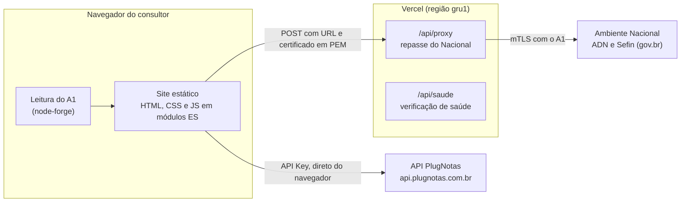

<div align="center">


# Painel Técnico NFS-e

**A ferramenta de trabalho da Consultoria Técnica NFS-e da TecnoSpeed (PlugNotas).**

Operações em lote na API PlugNotas, consultas ao Ambiente Nacional da NFS-e,
de-para do XML do Nacional, relação IBS e CBS e validação do JSON de emissão,
num único painel que roda no navegador.


[Visão geral](#visão-geral) ·
[Funcionalidades](#funcionalidades) ·
[Arquitetura](#arquitetura) ·
[Primeiros passos](#primeiros-passos) ·
[Testes](#testes) ·
[Publicação](#publicação) ·
[Segurança](#segurança) ·
[Governança](#governança)

</div>

---

## Sumário

- [Visão geral](#visão-geral)
- [Funcionalidades](#funcionalidades)
- [Arquitetura](#arquitetura)
- [Primeiros passos](#primeiros-passos)
- [Testes](#testes)
- [Definições e catálogos](#definições-e-catálogos)
- [Regenerar o de-para e as tabelas do IBS e da CBS](#regenerar-o-de-para-e-as-tabelas-do-ibs-e-da-cbs)
- [Publicação](#publicação)
- [Segurança](#segurança)
- [Governança](#governança)
- [Estrutura do repositório](#estrutura-do-repositório)
- [Limitações conhecidas](#limitações-conhecidas)
- [Contribuição](#contribuição)
- [Documentação relacionada](#documentação-relacionada)

## Visão geral

O Painel Técnico NFS-e reúne, numa só ferramenta, o que o consultor usa no
suporte técnico de NFS-e:

| Objetivo | Como o painel resolve |
|---|---|
| Executar rotas do PlugNotas em lote | Uma tela por rota, com lista de IDs, execução em paralelo e retorno completo |
| Consultar o Ambiente Nacional (ADN e Sefin) | Repasse próprio para o gov.br, com o certificado A1 do consultor |
| Entender o XML do Nacional | De-para de cada tag do anexo VI, com regras de negócio e o campo do PlugNotas que a preenche |
| Classificar IBS e CBS | Relação entre item da LC 116, NBS, indOp e cClassTrib (anexos VII e VIII) |
| Evitar rejeições | Validador do JSON de emissão, com a fonte de cada achado |

**Público:** consultores internos da TecnoSpeed. Não é um produto para o
cliente final.

**Princípios do projeto**

- **A API Key não passa pelo servidor.** O navegador chama a API PlugNotas
  direto. Só os perfis salvos ficam gravados no navegador; a chave digitada
  sem perfil fica só na aba aberta.
- **Nada é afirmado sem fonte.** Toda regra, limite ou mensagem vem de um
  documento: anexos do Nacional, documentação do PlugNotas, lib, script ou
  cálculo sobre o JSON.
- **Simplicidade.** HTML, CSS e JavaScript em módulos ES, sem framework, sem
  build e sem banco de dados. O único backend é o repasse do Nacional.

## Funcionalidades

### Rotas do PlugNotas

| Grupo | Telas |
|---|---|
| **Notas** | Resolve em lote (situação conferida antes e depois); consulta por ID, idIntegracao ou período, com consulta completa pelo ID; download de XML e PDF, regeração de PDF e reenvio por e-mail; cancelamento e status do cancelamento, eventos, sincronização e interrupção |
| **Empresa** | Cadastro (por CNPJ, todas da conta e logotipo), webhook da empresa ou da organização (com envio de teste) e certificados |

- Listas de IDs coladas, digitadas ou importadas de CSV ou TXT, com os
  repetidos removidos.
- Execução em paralelo, com barra de progresso, cancelamento e exportação em
  CSV.
- O cartão **Retorno** mostra a resposta crua: corpo, status HTTP, tipo do
  conteúdo, tempo e URL chamada.
- Rotas que alteram dados aparecem marcadas no menu e pedem confirmação.
- O **Resolve** faz novas tentativas em falhas temporárias, respeita
  `Retry-After`, espera os eventos do emissor Nacional e fecha cada nota com
  um desfecho claro (Resolvido, Continua rejeitada, Cancelado e outros).
- Campos com formato definido são preenchidos com a máscara enquanto o
  consultor digita: código de tributação (`00.00.00.000`), CPF, CNPJ e código
  IBGE. Valor incompleto é recusado antes de chamar a API.

### Ambiente Nacional

- Consultas ao ADN e à Sefin: convênio, alíquota, benefício, CNC, NFS-e por
  chave, DPS e DANFSe, em produção ou produção restrita.
- **As consultas exigem certificado digital.** O consultor carrega um A1
  ICP-Brasil (`.pfx` ou `.p12`), de qualquer CNPJ, e a senha na tela. O arquivo
  e a senha são lidos no navegador; só a chave e a cadeia seguem para o
  repasse, a cada consulta, sem serem guardadas.

### Conhecimento do XML e da reforma tributária

- **De-para do Nacional:** 430 tags e 579 regras do anexo VI, com busca por
  tag, descrição, caminho, código de rejeição (ex.: `E0580`) ou campo do JSON.
  O popup de cada tag traz as regras de negócio, a descrição completa e o
  campo do JSON e do TX2 que a preenchem.
- **Relação IBS e CBS:** pesquisa por item da LC 116 ou por indOp, com NBS,
  local de incidência e cClassTrib, cada código com a descrição dos anexos VII
  e VIII.
- **Validador de JSON:** confere o corpo do `POST /nfse` no próprio navegador.
  Cada achado cita a fonte e liga as tags afetadas ao popup de regras.

### Recursos da interface

- Padrão visual do design system da TecnoSpeed, com tema claro e escuro e a cor
  da marca. No celular, o menu vira gaveta aberta por um botão flutuante.
- Painel de **Logs** da sessão, com identificação do consultor e exportação em
  TXT.
- Perfis de API Key por apelido, gravados no navegador, para alternar entre
  contas sem digitar a chave de novo.
- Manual de uso em PDF no botão **Documentação**.

## Arquitetura



| Camada | Tecnologia |
|---|---|
| Front-end | HTML, CSS e JavaScript em módulos ES nativos, sem framework e sem build |
| Funções | Node.js 24 na Vercel, região `gru1` (São Paulo) |
| Biblioteca no navegador | node-forge 1.4.0, vendorizado e carregado com SRI só para ler o A1 |
| Fonte | Quicksand, servida pelo próprio site |
| Dados | JSON versionados em `definicoes/` |
| Ferramentas | Python 3.10+ (openpyxl, reportlab e svglib), fora do site |
| Testes | Node com jsdom e node-forge; Python com openpyxl |

**Telas guiadas por catálogo.** Cada rota de `definicoes/rotas.json` e
`definicoes/rotas-nacional.json` vira item de menu e tela, sem código novo. O
código de cada tela é carregado só quando ela é aberta.

**Por que um repasse?** O navegador não consegue chamar o gov.br direto (não
há CORS), e o Nacional exige certificado de cliente na conexão. O repasse
aceita só os domínios do Nacional e não guarda nada.

## Primeiros passos

### Requisitos

- [Node.js 24](https://nodejs.org/) para os testes e o servidor local.
- Python 3.10 ou mais novo, só para regenerar as definições e o manual.
- Chrome ou Edge, para a verificação de CSP no navegador.

### Executar localmente

```bash
git clone https://github.com/hugozuin/painel-tecnico-nfse.git
cd painel-tecnico-nfse

# servidor estático na porta 3500
npm run dev
```

Abra `http://localhost:3500`. No servidor estático, as telas do Nacional não
funcionam, porque dependem da função `api/proxy`. Para testá-las localmente,
use a CLI da Vercel (exige login e vínculo com o projeto):

```bash
npx vercel dev
```

No Windows, o `iniciar.bat` (fora do Git) confere o Node.js, sobe o servidor e
abre o navegador.

### Preparar o ambiente de desenvolvimento

```bash
cd testes && npm install        # dependências dos testes, uma vez
git config core.hooksPath .githooks   # roda o npm test antes de cada push
```

## Testes

```bash
cd testes
npm test                  # todas as suítes
npm run test:detalhes     # cada verificação, uma por linha
npm run verificar:csp     # CSP e SRI num Chrome ou Edge real
```

```bash
python testes/teste_fontes.py   # de-para conferido contra as planilhas dos anexos
```

São 13 suítes Node, com cerca de 650 verificações, entre elas:

| Área | O que é garantido |
|---|---|
| Segurança | Destino da API Key, cabeçalhos, entrada e saída do repasse, A1 sem vestígio no navegador, varredura de dados sensíveis |
| Contrato | Rotas conferidas na documentação do PlugNotas |
| Interface | A aplicação montada no jsdom, tela a tela |
| Padrões | Sem comentários no código, sem `innerHTML` e afins |
| Desempenho | JS da abertura até 49 KB com gzip; buscas e validação dentro do orçamento |

O guia completo das suítes está em [`testes/README.md`](testes/README.md).

## Definições e catálogos

O comportamento das telas vem dos arquivos de `definicoes/`:

| Arquivo | Conteúdo | Origem |
|---|---|---|
| `rotas.json` | Catálogo das rotas do PlugNotas | Escrito à mão |
| `rotas-nacional.json` | Catálogo das consultas do Nacional | Escrito à mão |
| `regras-validacao.json` | Regras declarativas do validador, cada uma com fonte | Escrito à mão |
| `config.json` | Leitura remota e botão Repositório | Escrito à mão |
| `de-para-nacional.json` | De-para do anexo VI | Gerado |
| `ibscbs.json` | Anexos VII e VIII | Gerado |

Uma rota nova entra no catálogo, sem código novo:

```json
{
  "id": "email",
  "grupo": "Notas",
  "titulo": "Envio de e-mail",
  "metodo": "POST",
  "caminho": "/nfse/email/{item}",
  "entrada": { "tipo": "lote", "rotulo": "IDs das notas" },
  "campos": [
    { "id": "destinatarios", "rotulo": "Destinatários", "tipo": "lista", "obrigatorio": true, "destino": "corpo.destinatarios" }
  ],
  "resultado": { "tipo": "mensagem" },
  "sensivel": true,
  "confirmar": "Um e-mail será enviado para os destinatários informados."
}
```

A referência de todos os atributos está em
[`definicoes/README.md`](definicoes/README.md).

## Regenerar o de-para e as tabelas do IBS e da CBS

```bash
pip install openpyxl

python ferramentas/gerar_definicoes.py --anexos fontes/nacional \
  --script <caminho>/LoadEnvio.txt \
  --mapeamento <caminho>/Mapping.txt \
  --lib <caminho>/buildTx2/padrao-NACIONAL/props \
  --saida definicoes
```

O gerador liga quatro elos: lib do PlugNotas (JSON para TX2), script do
Nacional (TX2 para dataset), `Mapping.txt` (dataset para caminho XML) e anexo
VI (caminho para tag). Quando um elo não fecha, a tela diz que o campo não foi
identificado, em vez de supor. As lacunas da última geração ficam em
`ferramentas/relatorio-geracao.json`.

> [!IMPORTANT]
> Os insumos internos do PlugNotas (`LoadEnvio.txt`, `Mapping.txt` e a lib)
> entram no gerador só por parâmetro e **nunca** vão para o repositório. O JSON
> publicado guarda nomes de campo e números de linha, nunca trechos de código.

Detalhes e heurísticas do gerador em
[`ferramentas/README.md`](ferramentas/README.md). Para o manual em PDF:
`python ferramentas/gerar_manual.py`.

## Publicação

| Item | Configuração |
|---|---|
| Plataforma | Vercel, Framework Preset **Other**, sem comando de build e sem variáveis de ambiente |
| Deploy | Automático a cada commit no `main`, em cerca de um minuto; se falhar, o anterior continua no ar |
| Proteção | Deployment Protection em **Standard Protection**: produção aberta, prévias de outros branches protegidas |
| Funções | `api/proxy.js` e `api/saude.js`, Node 24, região `gru1` |
| Fora do site | Gerador, anexos, testes, documentação e READMEs (`.vercelignore`) |

Depois de cada deploy, confira a saúde e os cabeçalhos:

```bash
curl -s https://painel-tecnico-nfse.vercel.app/api/saude
curl -sI https://painel-tecnico-nfse.vercel.app/
```

A resposta esperada da saúde é `{"situacao":"ok","versao":"<versão do package.json>"}`.
O procedimento de recuperação está em
[`docs/governanca/operacao.md`](docs/governanca/operacao.md).

## Segurança

| Tema | Controle |
|---|---|
| **API Key** | Vai só para `https://api.plugnotas.com.br`; outro destino é recusado antes do `fetch`. Os perfis ficam no `localStorage` até serem apagados na tela ou até a limpeza dos dados do navegador; a chave digitada sem perfil fica só no `sessionStorage` da aba |
| **Certificado A1** | Lido no navegador; a senha nunca sai dele e é apagada do campo depois de cada leitura. Nada é persistido |
| **Repasse** | Só `https`, só os domínios do ADN e da Sefin na porta padrão, corpo até 64 KB, PEM conferido, prazo de 30 s, resposta até 4 MB. Toda resposta sai com CSP `sandbox`, `nosniff` e `no-store` |
| **Log** | Uma linha JSON por consulta ao repasse, sem corpo, identificadores, chave ou certificado |
| **Cabeçalhos** | CSP estrita (tudo do próprio site, conexões só com o site e a API PlugNotas), Permissions-Policy, COOP e `X-Robots-Tag: noindex, nofollow` |
| **DOM** | Sem `innerHTML`, `eval` e afins; tudo por `textContent` |
| **Dependências** | Nada de CDN; bibliotecas vendorizadas com versão fixa, licença e SRI |
| **Sigilo** | Varredura automática de IDs, CNPJs, CPFs, chaves e tokens em todo o repositório |

Os requisitos completos estão na seção 6 do [`CLAUDE.md`](CLAUDE.md).

> [!NOTE]
> Não há limitador por IP no código do repasse. A proteção recomendada é uma
> regra de rate limit no firewall (WAF) da Vercel para `/api/proxy`.

## Governança

Pelas políticas corporativas, o painel é classificado como **Aplicação
crítica**: executa ações fiscais na API de produção, fica exposto na internet e
usa credenciais de clientes.

A ficha da aplicação, o checklist por etapa, o inventário de dados e LGPD, a
operação e as exceções em aberto estão em
[`docs/governanca/`](docs/governanca/README.md).

## Estrutura do repositório

```
.
├── index.html            estrutura da página, cabeçalho, menu e modais
├── styles.css            tema claro e escuro com os tokens da marca
├── assets/               logotipos, favicon e vendor/ (forge, Quicksand e licenças)
├── js/
│   ├── app.js            catálogo de telas, menu, roteamento e logs
│   ├── plugnotas.js      cliente HTTP da API PlugNotas
│   ├── certificado.js    leitura do A1 no navegador
│   ├── mascaras.js       máscaras dos campos do catálogo
│   ├── analise/          uma conferência do validador por módulo
│   └── telas/            telas de rota, Resolve, Nacional, de-para, IBS e CBS e validador
├── api/
│   ├── proxy.js          repasse das consultas do Nacional
│   └── saude.js          verificação de saúde
├── definicoes/           catálogos, regras, de-para e tabelas do IBS e da CBS
├── fontes/nacional/      anexos VI, VII e VIII (públicos)
├── ferramentas/          gerador das definições e do manual
├── testes/               suítes Node, conferência das planilhas e verificação no navegador
├── docs/governanca/      ficha, checklist, dados e LGPD, operação e exceções
├── CHANGELOG.md          histórico de versões
└── documentacao.pdf      manual de uso
```

## Limitações conhecidas

- **Nomes de TX2 divergentes.** Em alguns campos, a lib e o script do Nacional
  usam nomes diferentes (a lib gera `ValorIRRF`, o script lê `ValorIR`). Nesses
  casos o de-para mostra o campo lido pelo script e informa que o campo do JSON
  não foi identificado.
- **Mapeamento da v1.01.** O `Mapping.txt` do componente é da v1.01, e alguns
  caminhos dele não existem no leiaute RTC do anexo VI (ex.: `vDedRed`). Essas
  tags aparecem sem o lado do PlugNotas.
- **Alcance do validador.** Regras que dependem de parametrização municipal ou
  de cadastro no ADN aparecem no popup, mas não são conferidas.

## Contribuição

1. Leia o [`CLAUDE.md`](CLAUDE.md): arquitetura, requisitos de segurança,
   padrões de código e decisões registradas.
2. Código, textos e mensagens de commit em português; nomes descritivos e sem
   comentários no código.
3. Commits pequenos, com mensagem no imperativo (ex.: "Adiciona CSP no
   vercel.json").
4. `npm test` verde antes de cada commit. Todo defeito corrigido ganha um teste
   que falha no código antigo.
5. Rota nova ou alterada é conferida antes na
   [documentação do PlugNotas](https://docs.plugnotas.com.br) e entra no teste
   de contrato.

> [!WARNING]
> Todo commit no `main` vai ao ar. Nunca use IDs, CNPJs, chaves de acesso ou
> API Keys reais em código, catálogos, exemplos ou testes.

## Documentação relacionada

| Documento | Conteúdo |
|---|---|
| [`CLAUDE.md`](CLAUDE.md) | Referência técnica completa: arquitetura, segurança, padrões e decisões |
| [`CHANGELOG.md`](CHANGELOG.md) | Histórico de versões |
| [`definicoes/README.md`](definicoes/README.md) | Como alimentar os catálogos e as regras |
| [`ferramentas/README.md`](ferramentas/README.md) | Gerador das definições e do manual |
| [`testes/README.md`](testes/README.md) | Guia das suítes de teste |
| [`docs/governanca/`](docs/governanca/README.md) | Governança, dados e LGPD, operação e exceções |
| `documentacao.pdf` | Manual de uso para o consultor |

---

<div align="center">

**Painel Técnico NFS-e · Consultoria Técnica NFS-e** · TecnoSpeed<br/>
<sub>Desenvolvido por Hugo Zuin · Uso interno, código proprietário</sub>

</div>
