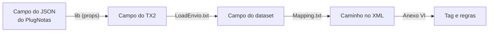

# Ferramentas

Scripts Python que rodam **fora do site**, na máquina de quem mantém o painel.
A pasta inteira fica fora do deploy (`.vercelignore`).

| Arquivo | Função | Dependências |
|---|---|---|
| [`gerar_definicoes.py`](gerar_definicoes.py) | Gera `definicoes/de-para-nacional.json` e `definicoes/ibscbs.json` | Python 3.10+, openpyxl |
| [`gerar_manual.py`](gerar_manual.py) | Gera o manual de uso `documentacao.pdf` | Python 3.10+, reportlab, svglib |
| `relatorio-geracao.json` | Lacunas da última geração do de-para | Gerado |

## Instalação

```bash
pip install openpyxl reportlab svglib
```

## Gerar o de-para e as tabelas do IBS e da CBS

```bash
python ferramentas/gerar_definicoes.py --anexos fontes/nacional \
  --script <LoadEnvio.txt> \
  --mapeamento <Mapping.txt> \
  --lib <pasta props da lib> \
  --saida definicoes
```

| Parâmetro | Obrigatório | Conteúdo |
|---|---|---|
| `--anexos` | Sim | Pasta com os anexos VI, VII e VIII (públicos, em `fontes/nacional`) |
| `--script` | Não | `LoadEnvio.txt` do padrão Nacional (interno) |
| `--mapeamento` | Não | `Mapping.txt` do componente (interno) |
| `--lib` | Não | Pasta `props` da lib `buildTx2/padrao-NACIONAL` do PlugNotas (interna) |
| `--saida` | Não | Pasta de destino dos JSON (`definicoes`) |

O uso completo está em `python ferramentas/gerar_definicoes.py --help`.

### Como a cadeia é montada



Quando um elo não fecha, a tela diz "campo do JSON não identificado nas fontes
analisadas" em vez de supor. As lacunas ficam em `relatorio-geracao.json`.

> [!IMPORTANT]
> Script, mapeamento e lib são **internos do PlugNotas**. Entram no gerador só
> por parâmetro e nunca vão para o repositório. O JSON gerado guarda nomes de
> campo e números de linha, nunca trechos de código (há teste para isso).

> [!WARNING]
> Sem `--script`, `--mapeamento` e `--lib`, o gerador produz só o lado do
> Nacional e regrava o `relatorio-geracao.json` parcial. Não faça commit desse
> relatório nem de um de-para gerado sem os insumos internos.

### Trocar um anexo por versão nova

1. Substitua o arquivo em `fontes/nacional`.
2. Ajuste o nome do arquivo no topo do gerador.
3. Gere de novo com todos os parâmetros.
4. Confira com `python testes/teste_fontes.py` e `cd testes && npm test`.

## Gerar o manual

```bash
python ferramentas/gerar_manual.py
```

Regrava o `documentacao.pdf` na raiz. O texto do manual fica no próprio script;
ao mudar um comportamento visível, atualize o texto e gere de novo. A varredura
de dados sensíveis também lê o texto do PDF.

## Como o gerador decide

Regras que explicam escolhas do `gerar_definicoes.py` e que não estão nos nomes
das funções.

| Tema | Função ou constante | Regra |
|---|---|---|
| Raízes do JSON | `RAIZES_JSON_CONFIRMADAS` | `prestador`, `tomador`, `servico[]` e `ibscbs` foram confirmadas pelo exemplo de emissão da coleção do Postman do PlugNotas. Outras raízes, como a do intermediário, ainda não estão confirmadas (CLAUDE.md, seção 9) |
| Cópia direta | `SETTERS` e `jsonCopiaDireta` | Uma gravação conta como cópia direta só quando recebe o campo do TX2 puro, sem conversão. As gravações de moeda convertem o formato numérico e não contam. Só os campos de cópia direta recebem a conferência de tamanho e tipo do anexo VI no validador |
| Título da tag | `titulo_da_descricao` | Trecho da descrição do anexo antes dos dois pontos ou a primeira frase, cortado em 120 caracteres. Nada do anexo é reescrito |
| Caminhos com grafia diferente | `aproximar_caminho` | Quando a aba de regras do anexo VI escreve o caminho de outro jeito que o leiaute (ex.: `totalTrib` e `totTrib`), a regra é ligada à tag de mesmo nome com a maior semelhança, desde que alta e sem empate. Essas regras saem marcadas com `caminhoNaAbaDeRegras` |
| Condição de linha única | `guarda` | É a condição do `if ... then`, do `else` ou do rótulo de `case` na mesma linha ou na linha anterior. Sem nenhuma, a atribuição não é condicional |

### Leitura do script do Nacional (`ler_script`)

Cada campo do dataset é ligado aos campos do TX2 que determinam seu valor, de
três formas:

| Forma | Quando |
|---|---|
| `direto` | O campo do TX2 aparece na própria chamada que grava o dataset |
| `calculado` | O valor gravado é uma variável montada a partir de campos do TX2 |
| `condicao` | O valor gravado é fixo e depende do `if` ou `case` que o controla |

A análise acompanha os blocos `begin`, `case` e `try` para não ligar uma
atribuição feita em outro ramo do mesmo `case`. Uma atribuição termina no ponto
e vírgula ou antes de `else` ou `end`, como em `if X then v := A else v := B;`.
