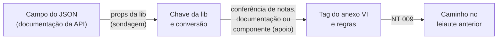

# Ferramentas

Scripts que rodam **fora do site**, na máquina de quem mantém o painel. A pasta
inteira fica fora do deploy (`.vercelignore`).

| Arquivo | Função | Dependências |
|---|---|---|
| [`gerar_definicoes.py`](gerar_definicoes.py) | Gera `definicoes/de-para-nacional.json` e `definicoes/ibscbs.json` | Python 3.10+, openpyxl, Node |
| [`documentacao_api.py`](documentacao_api.py) | Lê o `api.json` público da documentação da API e achata o esquema do Nacional | Python |
| [`sondar_lib.py`](sondar_lib.py) | Executa as props da lib com notas sintéticas e descobre o que cada chave faz | Python, Node |
| [`executar_lib.cjs`](executar_lib.cjs) | Carrega as props da lib no Node, com substitutos para as utilidades ausentes | Node |
| [`leitura_getrps.py`](leitura_getrps.py) | Lê o `getRps.js` sem executá-lo (fonte secundária) | Python |
| [`conferir_notas.py`](conferir_notas.py) | Compara pares de JSON e XML de notas reais com o de-para | Python, Node |
| [`gerar_manual.py`](gerar_manual.py) | Gera o manual de uso `documentacao.pdf` | Python 3.10+, reportlab, svglib |
| `relatorio-geracao.json` | Cobertura e lacunas da última geração do de-para | Gerado |
| `conferencia-notas.json` | Resultado agregado da última conferência de notas (só nomes e contagens) | Gerado |

## Instalação

```bash
pip install openpyxl reportlab svglib
```

O gerador também precisa do Node (o mesmo dos testes), para executar as props.

## Gerar o de-para e as tabelas do IBS e da CBS

```bash
python ferramentas/gerar_definicoes.py --anexos fontes/nacional \
  --api <api.json> \
  --lib <pasta props de buildTx2/padrao-NACIONAL> \
  --rps <getRps.js> \
  --script <LoadEnvio.txt> \
  --mapeamento <Mapping.txt> \
  --notas <pasta com pares de notas> \
  --saida definicoes
```

| Parâmetro | Conteúdo | Origem |
|---|---|---|
| `--anexos` | Anexos VI (1.04 e 1.03), VII e VIII e a NT 009 | Públicos, em `fontes/nacional` |
| `--api` | `api.json` que o docs.plugnotas.com.br carrega | Público, baixar em `https://docs.plugnotas.com.br/api.json` |
| `--lib` | Pasta `props` de `buildTx2/padrao-NACIONAL` | Interno |
| `--rps` | `buildTx2/getRps.js` | Interno |
| `--script` | `Scripts/Nacional/LoadEnvio.txt` do componente | Interno, só apoio |
| `--mapeamento` | `Esquemas/Nacional/v1.01/Mapping.txt` do componente | Interno, só apoio |
| `--notas` | Pasta com pares `<nome>.json` (JSON de emissão) e `<nome>.xml` (DPS gerada) | Interno e sensível |
| `--saida` | Pasta de destino dos JSON (`definicoes`) | |

Sem `--lib`, o de-para sai só com o lado do Nacional. Sem `--notas`, vale o
último `conferencia-notas.json`. O uso completo está em
`python ferramentas/gerar_definicoes.py --help`.

> [!IMPORTANT]
> Lib, getRps, script, mapeamento e notas são **internos**. Entram só por
> parâmetro, de uma pasta fora do repositório, e nunca vão para o Git. O
> de-para guarda nomes de campo, números de linha e tabelas de valores; o
> relatório da conferência guarda só nomes de tag, nomes de campo documentados
> ou lidos pela lib, a versão da DPS, o `verAplic` e contagens. Nenhum valor de
> nota sai da máquina.

### Como a cadeia é montada



1. **Documentação da API** (`documentacao_api.py`). Achata o esquema
   `dadosNfseNacional` em caminhos (`servico[].iss.aliquota`), com tipo,
   tamanho, valores aceitos, padrão e as tags que a descrição cita.
2. **Sondagem das props** (`sondar_lib.py` e `executar_lib.cjs`). Monta notas
   sintéticas com um valor sentinela em cada campo documentado, varia um campo
   por vez, sem e com `versaoEsquema` RTC007, e observa a saída de cada chave.
   Daí saem a origem, a cópia direta, o arredondamento, a data, a concatenação,
   a soma, as tabelas de conversão, as condições e os campos que a lib só lê
   como número. `formatRounding` e `formatDate` não estão nos insumos e são
   substituídos: o arredondamento sai como "regra não confirmada".
3. **getRps.js** (`leitura_getrps.py`). Leitura estática, só para tags que as
   props não cobrem (datas, série, número, substituição). Nas funções com ramos
   por padrão, vale o último retorno. Uso no Nacional não confirmado.
4. **Ponte da chave para a tag.** Em ordem de força: conferência de notas,
   citação na documentação da API, nomes do script e do mapeamento do
   componente (só apoio) e, para chaves com tabela de códigos, nome da chave e
   códigos aceitos pela tag.
5. **Conferência de notas** (`conferir_notas.py`). Para cada tag do XML,
   compara o valor com os campos do JSON e com a saída da lib aplicada à mesma
   nota. Compara só quando o campo de origem está no JSON (a API completa o
   prestador pelo cadastro e calcula valores antes da lib).
6. **Leiaute anterior.** O XML gerado hoje segue o anexo VI 1.03. As mudanças
   de caminho para o 1.04 vêm dos itens 2.2, 2.3, 2.6 e 2.7 da NT 009
   (`EQUIVALENCIAS_DA_NT009`); uma equivalência só vale se o destino existir no
   anexo 1.04.

### Formato 3 do de-para

Cada tag da DPS traz `plugnotas` com:

| Campo | Conteúdo |
|---|---|
| `situacao` | `preenchida`, `semCampoJson` (fixo, numeração ou cadastro), `camposPrefeitura` (só pelos campos da prefeitura, via `@`) ou `semOrigem` |
| `json`, `jsonCopiaDireta` | Campos do JSON; os de cópia direta recebem a conferência de tamanho e tipo no validador |
| `origens` | Fonte (`lib`, `getRps` ou `json`), chave, arquivo e linha, campos com modo e condições, tabelas, `ligacao` e `notas` da conferência |
| `documentacao` | O que a documentação da API diz de cada campo |
| `inconsistencias` | Tipo, texto e fontes; na tela, viram o aviso discreto |
| `caminhoNoXmlGerado` | Caminho da tag no XML gerado hoje, quando difere do anexo 1.04 |
| `apoio` | Origens do componente e do getRps que não viraram principais, campos do TX2, mapeamento e linhas do script |

A entrada também pode trazer `leiauteAnterior`, com o caminho no anexo 1.03 e o
item da NT 009.

### Como o gerador decide

| Tema | Função | Regra |
|---|---|---|
| Descoberta nas notas | `escolher_descobertas` | Valor longo: fica o candidato igual em todas as notas e presente no maior número delas. Código curto (até 2 caracteres): só com nome parecido com a tag (`semelhanca`, sem palavras genéricas como "tipo") e em pelo menos 3 notas, ou com semelhança forte |
| Domínio | `dentro_do_dominio` | Chave com tabela só liga a tag cujos códigos no anexo VI cobrem todas as saídas |
| Bloqueio da descoberta | `decidir` | Não procura candidatos novos quando uma chave da lib proposta já foi confirmada |
| Fonte principal | `decidir` | Com origem na lib, getRps e JSON que leem outro campo vão para `apoio` e geram inconsistência |
| Cópia direta | `manter_copia_direta_so_com_tag_unica` | Só quando o campo alimenta uma única tag (ex.: `prestador.cpfCnpj` alimenta CPF e CNPJ e fica sem) |
| Campo documentado não lido | `campo_documentado_para` | Campo fora da documentação ganha o par documentado do mesmo grupo cuja descrição começa pelo título da tag |
| Título da tag | `titulo_da_descricao` | Trecho da descrição do anexo antes dos dois pontos ou a primeira frase, cortado em 120 caracteres |
| Caminhos da aba de regras | `aproximar_caminho` | Regra cujo caminho difere do leiaute é ligada à tag de mesmo nome mais parecida, sem empate, e marcada com `caminhoNaAbaDeRegras` |

### Leitura do script do componente (apoio)

`ler_script` liga cada campo do dataset aos campos do TX2 que determinam seu
valor (`direto`, `calculado` ou `condicao`), acompanhando os blocos `begin`,
`case` e `try`. Aceita cabeçalhos de `if` e `case` em várias linhas e compara
nomes sem diferenciar maiúsculas, como o `FindField` do componente. A
conferência de notas mostrou que o XML do PlugNotas não sai desse script
(`verAplic` diferente e chaves que o script não lê), por isso ele só serve de
ponte de nomes.

## Conferir notas isoladamente

```bash
python ferramentas/conferir_notas.py --notas <pasta> --lib <pasta props> --api <api.json> --saida <arquivo fora do repositório>
```

Mostra, por tag, os candidatos e as contagens, sem valores. Use para investigar
uma divergência antes de gerar de novo.

## Trocar um anexo por versão nova

1. Substitua o arquivo em `fontes/nacional` e ajuste o nome no topo do gerador.
2. Se o leiaute mudou de caminho, confira a nota técnica e as regras de
   `EQUIVALENCIAS_DA_NT009`.
3. Gere de novo com todos os parâmetros.
4. Confira com `python testes/teste_fontes.py`, `python testes/teste_gerador.py`
   e `cd testes && npm test`.

## Gerar o manual

```bash
python ferramentas/gerar_manual.py
```

Regrava o `documentacao.pdf` na raiz. O texto do manual fica no próprio script;
ao mudar um comportamento visível, atualize o texto e gere de novo. A varredura
de dados sensíveis também lê o texto do PDF.
